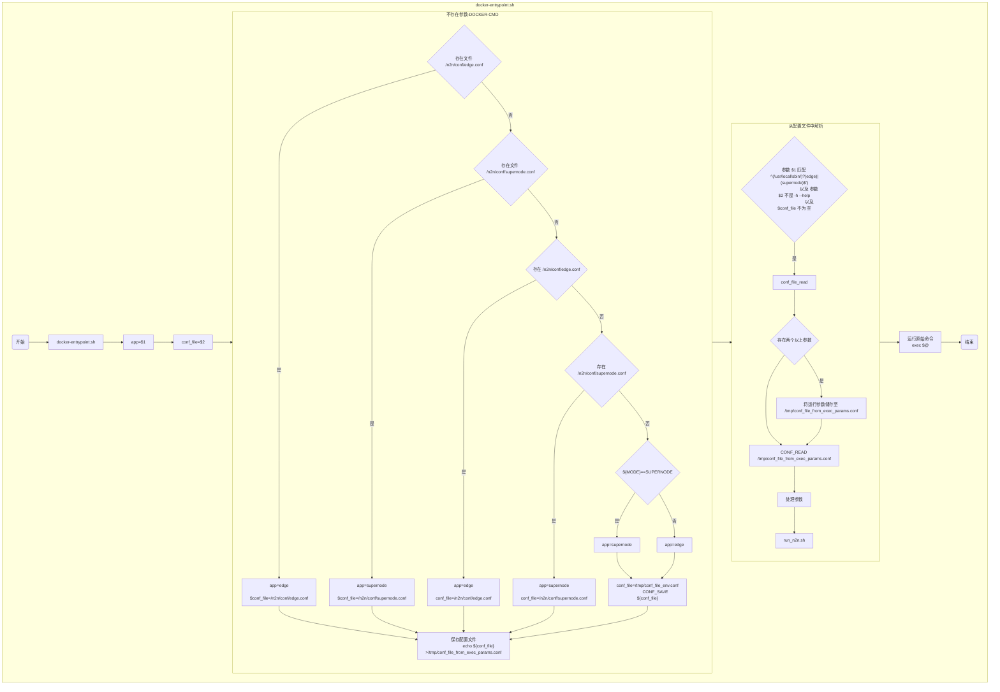

# docker n2n

## 关于

[n2n][n2n] 是一个 **第二层对等 VPN**，可轻松创建绕过中间防火墙的虚拟网络。

通过编译 [ntop 团队][ntop] 发布的 n2n,直连成功率高(仅局域网内不及), 且速度更快.

N2N 是通过 UDP 方式建立链接，如果某个网络禁用了 UDP，那么该网络下的设备就不适合使用本软件来加入这个虚拟局域网（用"blue's port scanner"，选择 UDP 来扫描，扫出来的就是未被封的，正常情况下应该超级多）

为了开始使用 N2N，需要两个元素：

1. _supernode_ ：
   它允许 edge 节点链接和发现其他 edge 的超级节点。
   它必须具有可在公网上公开端口。

2. _edge_ ：将成为虚拟网络一部分的节点;
   在 n2n 中的多个边缘节点之间共享的虚拟网络称为 community。

单个 supernode 节点可以中继多个 edge，而单个电脑可以同时连接多个 supernode。
边缘节点可以使用加密密钥对社区中的数据包进行加密。
n2n 尽可能在 edge 节点之间建立直接的 P2P 连接;如果不可能（通常是由于特殊的 NAT 设备），则超级节点也用于中继数据包。

### 组网示意

![组网示意][组网示意]

### 连接原理

![连接原理][连接原理]

## 快速入门

### 代码换行

通过以下符号分行,你可以分行输入你需要运行的代码

|       终端 |  符号  | 按键方法          |
| ---------: | :----: | :---------------- |
|       bash |   \\   | 回车键上方        |
| powershell | **`**  | 键盘 TAB 按钮上方 |
|        CMD | **＾** | 键盘 SHIFT+6      |

### 快速测试

```bash
docker run --rm -ti \
  --privileged \
  zctmdc/n2n
```

```bash
docker run --rm -ti \
 -p 10090:10090  \
 zctmdc/n2n \
 supernode -p 10090
```

<!--
### 建立 _supernode_

- 前台模式

```bash
docker run \
  --rm -ti \
  -e MODE="SUPERNODE" \
  -p 10090:10090/udp \
  zctmdc/n2n
```

- 后台模式

```bash
docker run \
  -d --restart=always \
  --name=supernode_t1 \
  -e MODE="SUPERNODE" \
  -e SUPERNODE_PORT=10090 \
  -p 10090:10090/udp \
  zctmdc/n2n
```

### 建立 _edge_

- 前台模式

```bash
docker run \
  --rm -ti \
  --privileged \
  --net=host \
  -e MODE="DHCPD" \
  -e EDGE_IP="10.11.12.1" \
  -e EDGE_COMMUNITY="n2n" \
  -e EDGE_KEY="test" \
  -e SUPERNODE_HOST=127.0.0.1 \
  -e SUPERNODE_PORT=10090 \
  -e EDGE_ENCRYPTION=A3 \
  -e EDGE_TUN=edge_dhcpd_t1 \
  zctmdc/n2n:sh-latest
```

- 后台模式

```bash
docker run \
  -d --restart=always \
  --name n2n_edge_dhcpc_t1 \
  --privileged  \
  --net=host \
  -e MODE="DHCPC" \
  -e EDGE_COMMUNITY="n2n" \
  -e EDGE_KEY="test" \
  -e SUPERNODE_HOST=127.0.0.1 \
  -e SUPERNODE_PORT=10090 \
  -e EDGE_ENCRYPTION=A3 \
  -e EDGE_TUN=edge_dhcpc_t1  \
  zctmdc/n2n:sh-latest
```

- test

```bash
docker exec -ti n2n_edge_dhcpc_t1 ifconfig edge_dhcpc_t1
``` -->



## MODE 模式

### SUPERNODE - 超级节点

```bash
docker run \
  -d --restart=always \
  --name=supernode_t2 \
  -e MODE="SUPERNODE" \
  -e SUPERNODE_PORT=10090 \
  -p 10090:10090/udp \
  zctmdc/n2n:sh-latest
```

### DHCPD - DHCP 服务端模式

```bash
docker run \
  -d --restart=always \
  --name n2n_edge_dhcpd_t2 \
  --privileged \
  --net=host \
  -e MODE="DHCPD" \
  -e EDGE_IP="10.21.22.1" \
  -e EDGE_COMMUNITY="n2n" \
  -e EDGE_KEY="test" \
  -e SUPERNODE_HOST=127.0.0.1 \
  -e SUPERNODE_PORT=10090 \
  -e EDGE_ENCRYPTION=A3 \
  -e EDGE_TUN=edge_dhcpd_t2 \
  zctmdc/n2n:sh-latest
```

如果你需要自定义 DHCPD 服务配置文件

```bash
-v path/to/dhcpd.conf:/n2n/conf/dhcpd.conf:ro
```

### DHCPC - DHCP 动态 IP 模式

```bash
docker run \
  -d --restart=always \
  --name n2n_edge_dhcpc_t2 \
  --privileged \
  --net=host \
  -e MODE="DHCPC" \
  -e EDGE_COMMUNITY="n2n" \
  -e EDGE_KEY="test" \
  -e SUPERNODE_HOST=127.0.0.1 \
  -e SUPERNODE_PORT=10090 \
  -e EDGE_ENCRYPTION=A3 \
  -e EDGE_TUN=edge_dhcpc_t2 \
  zctmdc/n2n:sh-latest
```

### STATIC - 静态 IP 模式

```bash
docker run \
  -d --restart=always \
  --name n2n_edge_static_t2 \
  --privileged \
  --net=host \
  -e MODE="STATIC" \
  -e EDGE_IP="10.21.22.23" \
  -e EDGE_COMMUNITY="n2n" \
  -e EDGE_KEY="test" \
  -e SUPERNODE_HOST=127.0.0.1 \
  -e SUPERNODE_PORT=10090 \
  -e EDGE_ENCRYPTION=A3 \
  -e EDGE_TUN=edge_static_t2 \
  zctmdc/n2n:sh-latest
```

## 使用 _docker compose_ 配置运行

see: [<docker-compose.yaml>](https://github.com/zctmdc/docker/blob/alpha/n2n/docker-compose.yaml)

```bash
# docker compose build #编译

docker compose up n2n_edge_dhcpc #前台运行 n2n_edge_dhcpc 依赖项将启动
docker exec n2n_edge_dhcpc busybox ping  10.31.32.1 # 测试
# docker compose exec n2n_edge_dhcpc busybox ping  10.31.32.1 # 测试
docker compose down
```

## 环境变量介绍

|          变量名 | 变量说明              | 备注                     | 对应参数                                                                                                    |
| --------------: | :-------------------- | :----------------------- | :---------------------------------------------------------------------------------------------------------- |
|            MODE | 模式                  | 对应启动的模式           | _`SUPERNODE`_ _`DHCPD`_ _`DHCPC`_ _`STATIC`_                                                                |
|  SUPERNODE_PORT | 超级节点端口          | 在 SUPERNODE/EDGE 中使用 | -l $SUPERNODE_PORT                                                                                          |
|  SUPERNODE_HOST | 要连接的 N2N 超级节点 | IP/HOST                  | -l $SUPERNODE_HOST:$SUPERNODE_PORT                                                                          |
|         EDGE_IP | 静态 IP               | 在静态模式和 DHCPD 使用  | -a $EDGE_IP                                                                                                 |
|  EDGE_COMMUNITY | 组网名称              | 在 EDGE 中使用           | -c $EDGE_COMMUNITY                                                                                          |
|        EDGE_KEY | 组网密码              | 在 EDGE 中使用           | -k $EDGE_KEY                                                                                                |
| EDGE_ENCRYPTION | 加密方式              | edge 间连接加密方式      | -A1 = disabled, -A2 = Twofish (default), -A3 or -A (deprecated) = AES-CBC, -A4 = ChaCha20, -A5 = Speck-CTR. |
|        EDGE_TUN | 网卡名                | edge 使用的网卡名        | -d $EDGE_TUN                                                                                                |
|        N2N_ARGS | 更多参数              | 运行时附加的更多参数     | -v -f                                                                                                       |
| USE_DEFALT_ARGS | 默认参数              | 运行时附加的默认参数     | `false` / `true` ：`v1:-br` , `v2:-EfrA` , `v2s:--bfr -L auto` , `v3:-Efr -e auto`                          |

## 运行流程

- docker-entrypoint.sh

    ```mermaid display:none
    flowchart TD
      subgraph docker-entrypoint.sh
        LOAD("开始")
        EXIT("结束")
        LOAD-->docker_entrypoint[docker-entrypoint.sh]-->set_app_use_parma1[app=$1]-->set_conf_file_use_parma2[conf_file=$2]-->EXEC_PARAMS

        EXEC_PARAMS{是否存在参数}-->|否|edge_conf
        EXEC_PARAMS{是否存在参数}-->|是|edge_or_supernode

        subgraph 不存在参数
          edge_conf{存在文件 /n2n/conf/edge.conf}-->
            |是|empty_conf_file_edge["
                                app=edge
                                $conf_file=/n2n/conf/edge.conf
                              "]
          edge_conf-->|否|supernode_conf{存在文件 /n2n/conf/supernode.conf}
          supernode_conf-->
            |是|empty_conf_file_supernode["
                                    app=supernode
                                    $conf_file=/n2n/conf/supernode.conf
                                  "]
          supernode_conf-->|否|exist_conf_edge_path_n2n{"存在 /n2n/conf/edge.conf"}

          exist_conf_edge_path_n2n-->
            |是|use_conf_edge_path_n2n["
                                        app=edge
                                        conf_file=/n2n/conf/edge.conf
                                      "]
          exist_conf_edge_path_n2n-->
            |否|exist_conf_supernode_path_n2n{"存在 /n2n/conf/supernode.conf"}

          exist_conf_supernode_path_n2n-->
            |是|use_conf_supernode_path_n2n["
                                        app=supernode
                                        conf_file=/n2n/conf/supernode.conf
                                      "]

          exist_conf_supernode_path_n2n-->
            |否|env_mode_supernode{"${MODE}==SUPERNODE"}
          env_mode_supernode-->
            |是|empty_use_supernode["app=supernode"]
          env_mode_supernode-->
            |否|empty_use_edge["app=edge"]
          empty_use_supernode & empty_use_edge -->
            conf_save_env["
                  conf_file=/tmp/conf_file_env.conf
                  CONF_SAVE ${conf_file}
                "]
          use_conf_edge_path_n2n & use_conf_supernode_path_n2n & empty_conf_file_edge & empty_conf_file_supernode & conf_save_env-->
          empty_conf_file_save["
                              保存配置文件
                              echo ${conf_file} >/tmp/conf_file_from_exec_params.conf
                            "]
        end

        empty_conf_file_save -->
          edge_or_supernode{"
                              参数 $1 匹配 ^(/usr/local/sbin/)?(edge)|(supernode)$')
                              以及 参数 $2 不是 -h --help
                              以及 $conf_file 不为 空
                            "}
        edge_or_supernode-->|是|CONF_READ

        subgraph 从配置文件中解析
          CONF_READ-->exec_params_more{"存在两个以上参数"}
          exec_params_more-->|是|conf_save_params["将运行参数储存至 /tmp/conf_file_from_exec_params.conf"]
          exec_params_more & conf_save_params -->
            conf_read["CONF_READ /tmp/conf_file_from_exec_params.conf"]-->change_env["处理参数"]
        end
        change_env-->run_n2n[run_n2n.sh]
        edge_or_supernode-->
          |否|exec_raw["
                        运行原始命令
                        exec $@
                      "]
        exec_raw & run_n2n --> EXIT
      end
    ```

- conf_read.sh

    ```mermaid
    flowchart TB
      subgraph conf_read.sh
      LOAD("开始")
      EXIT("结束运行")
        LOAD-->CONF_READ-->prama_1{"存在参数 $1"};
        prama_1-->|是|set_conf_file_read["设置conf_file_read=$1"]-->read_conf_file["解析文件"]-->inner_conf_file{"解析到引用其他配置文件"}
        inner_conf_file-->|是|CONF_READ
        inner_conf_file-->|否|parse_file["解析参数"]-->update_arg["更新参数"]
        prama_1  -->|否|EXIT
        update_arg -->EXIT
      end
    ```

- run_n2n.sh

    ```mermaid
    flowchart TB
      subgraph run_n2n.sh
        LOAD("开始")
        EXIT("结束运行")
        subgraph main
          main_start-->check_server["获取 SUPERNODE_IP"]-->
            case_MODE{"case ${MODE}"}
          case_MODE-->|SUPERNODE|mode_supernode
          case_MODE-->|DHCPD|mode_dhcpd
          case_MODE-->|DHCPC|mode_dhcpc
          case_MODE-->|STATIC|mode_static
          case_MODE-->|其他|case_faild
          mode_supernode & mode_dhcpd & mode_dhcpc & mode_static & case_faild -->
          main_finish
        end
        LOAD-->run_n2n_start["处理参数"]--->main-->check_run-->EXIT
      end
    ```

    ```mermaid
    flowchart TB
        subgraph init_dhcpd_conf
          init_dhcpd_conf_start["初始化 DHPCD 配置文件"]-->exist_conf_dhcpd_path_n2n{"存在 /n2n/conf/dhcpd.conf"}
          exist_conf_dhcpd_path_n2n-->|是|cp_conf_dhcpd["cp /n2n/conf/dhcpd.conf /etc/dhcp/dhcpd.conf"]
          exist_conf_dhcpd_path_n2n-->|否|exist_conf_udhcpd_path_n2n{"存在 /n2n/conf/udhcpd.conf"}
          exist_conf_udhcpd_path_n2n-->|是|cp_conf_udhcpd["cp /n2n/conf/udhcpd.conf /etc/dhcp/udhcpd.conf"]
          exist_conf_udhcpd_path_n2n-->
            |否|craet_conf_dhcpd["
                                  创建 /etc/dhcp/dhcpd.conf
                                  subnet ${IP_PREFIX}0 netmask ${EDGE_NETMASK}
                                  range ${IP_PREFIX}120 ${IP_PREFIX}240;
                                "]
          cp_conf_dhcpd &  cp_conf_udhcpd & craet_conf_dhcpd --> init_dhcpd_conf_finish["初始化 DHPCD 完毕"]
        end
    ```

    ```mermaid
    flowchart TB
        subgraph run_dhcpd
          run_dhcpd_start-->init_dhcpd_conf-->exist_conf_dhcpd_path_etc{"存在 /etc/dhcp/dhcpd.conf"}
          exist_conf_dhcpd_path_etc-->|是|start_dhcpd["dhcpd -f -d ${EDGE_TUN} &"]
          exist_conf_dhcpd_path_etc-->|否|exist_conf_udhcpd_path_etc{"存在 /etc/udhcp/dhcpd.conf"}
          exist_conf_udhcpd_path_etc-->|是|start_udhcpd["busybox udhcpd -f /etc/dhcp/udhcpd.conf &"]
          start_udhcpd-->run_dhcpd_finish
        end
    ```

    ```mermaid
    flowchart TB
        subgraph run_dhcpc
          run_dhcpc_start
            -->start_dhcpc["
              LOG_RUN dhclient -x
              LOG_RUN dhclient -d --dad-wait-time 5 ${EDGE_TUN} &
            "]
            -->run_dhcpc_finish
        end
    ```

    ```mermaid
    flowchart TB
        subgraph check_mac_address
          check_mac_address_start["检查$EDGE_MAC"]-->GET_MAC_FROM_WAN{"环境变量 GET_MAC_FROM_WAN值*大写"}
          GET_MAC_FROM_WAN-->|TRUE|INIT_EDGE_MAC_FROM_WAN["获取容器网关mac地址-1"]
          check_mac_address_valid{"是否合法"}
          GET_MAC_FROM_WAN-->|其他|check_mac_address_valid
          INIT_EDGE_MAC_FROM_WAN-->check_mac_address_valid
          check_mac_address_valid-->|是|mac_upper["$EDGE_MAC转大写"]
          check_mac_address_valid-->|否|mac_empty["$EDGE_MAC=''"]
          mac_upper & mac_empty-->check_mac_address_start_finish["检查完毕"]
        end
    ```

    ```mermaid
    flowchart TB
        subgraph check_edge
        check_edge_start["开始"]
        check_edge_start-->
          init_TOTLA_WAIT_TIME["TOTLA_WAIT_TIME=30"]
            --> startTime["记录开始时间"]
            -->sumTime["记录当前时间"]
            -->check_edge_time_out{"是否超时 / 30秒"}
          check_edge_time_out-->|是|EXIT
          check_edge_time_out-->|否|get_edge_addr{"判断EDGE是否启动成功"}
          get_edge_addr-->|是|check_edge_mode{"是否DHCPC模式"}
          get_edge_addr-->|否|sumTime
          check_edge_mode-->|是|run_dhcpc-->check_edge_addr{"是否获取到地址"}
          check_edge_mode-->|否|check_edge_addr
          check_edge_addr-->|否|sumTime
          check_edge_addr-->|是|check_edge_finish
        end
    ```

    ```mermaid
    flowchart TB
        subgraph run_edge
          run_edge_start["处理参数"]-->start_edge["命令方式运行"]
        end
    ```

    ```mermaid
    flowchart TB
        subgraph mode_dhcpd
          mode_dhcpd_start-->check_mac_address-->run_edge-->check_edge-->run_dhcpd-->mode_dhcpd_finish
        end
    ```

    ```mermaid
    flowchart TB
        subgraph mode_dhcpc
          mode_dhcpc_start-->mode_dhcpc_EDGE_IP{"EDGE_IP 是否包含 dhcp"}
          mode_dhcpc_EDGE_IP-->|否|mode_dhcpc_set_EDGE_IP_AGE["设置为 dhcp:0.0.0.0"]
          mode_dhcpc_EDGE_IP-->|是|mode_dhcpc_N2N_ARGS{"N2N_ARGS 是否包含 r"}
          mode_dhcpc_set_EDGE_IP_AGE-->mode_dhcpc_N2N_ARGS
          mode_dhcpc_N2N_ARGS-->|否|mode_dhcpc_add_N2N_ARG["添加 -r"]
          mode_dhcpc_N2N_ARGS-->|是|check_mac_address
          mode_dhcpc_add_N2N_ARG-->check_mac_address
          check_mac_address-->run_edge-->check_edge-->mode_dhcpc_finish
        end
    ```

    ```mermaid
    flowchart TB
        subgraph mode_static
          mode_static_start-->check_mac_address-->run_edge-->check_edgemode_static_finish
        end
    ```

    ```mermaid
    flowchart TB
        subgraph mode_supernode
          mode_supernode_start-->INIT_VERSION["获取small_version"]-->small_version{"small_version>2.9.0"}
          small_version-->|是|argp["ARG_SUPERNODE_PORT=-p ${SUPERNODE_PORT}"]
          small_version-->|否|argl["ARG_SUPERNODE_PORT=-l ${SUPERNODE_PORT}"]
          argp & argl--> run_supernode -->mode_supernode_finish
        end
    ```

    ```mermaid
    flowchart TB
        subgraph check_server
          check_server_start-->
            check_server_use_ping{"使用ping命令获取"}
          check_server_use_ping-->|获取失败|check_server_use_nslookup{"使用nslookup命令获取"}
          check_server_use_ping-->|获取成功|check_server_finish
          check_server_use_nslookup-->|获取失败|use_raw{"使用 $SUPERNODE_HOST"}
          check_server_use_nslookup-->|获取成功|check_server_finish
          use_raw-->check_server_finish
        end
    ```

    ```mermaid
    flowchart TB
        subgraph restart_edge
          restart_edge_start
            -->stop_dhclient
            -->killall_edge
            -->killall_dhcpd
            -->killall_udhcpd
            -->main
            -->restart_edge_finish
        end
    ```

    ```mermaid
    flowchart TB
        subgraph check_run
          check_run_start["开始"]
          check_server-->check_run_ip_change{"SUPERNODE_IP 变化"};
          check_run_start-->check_run_edge{"edge 模式"};
          check_run_edge-->|是|check_server
          check_run_edge-->|否|check_run_WATCH_DOG["${WATCH_DOG^^}==TRUE"];
          check_run_ip_change-->|是|restart_edge;
          check_run_ip_change-->|否|check_run_start;
          check_run_WATCH_DOG-->|是|check_run_n2n_healthcheck{"/n2n/n2n_healthcheck.sh出错"};
          check_run_WATCH_DOG-->|否|check_run_start;
          check_run_n2n_healthcheck-->|是|restart_edge;
          check_run_n2n_healthcheck-->|否|check_run_start;
          restart_edge-->check_run_finish;
        end
    ```

## 更多帮助

所有的通过此文件测试：[<docker-compose.test.yaml>](https://github.com/zctmdc/docker/blob/alpha/n2n/docker-compose.test.yaml) , [<compose-test.sh>](https://github.com/zctmdc/docker/blob/alpha/n2n/scripts/compose-test.sh)

更多帮助请参考 [好运博客][好运博客] 中 [N2N 新手向导及最新信息][n2n 新手向导及最新信息] , [N2N 支持参数版本一览表][n2n_args]

中文说明参考: [附加参数](https://bugxia.com/?s=附加参数) , [点对网](https://bugxia.com/?s=点对网）)

更多节点请访问 [N2N 中心节点][n2n中心节点]

更多 Docker 介绍请访问 [docker-compose CLI 概述][overview of docker-compose cli] , [Docker 运行参考](https://docs.docker.com/engine/reference/run/)

## 告诉我你在用

如果你使用正常了请点个赞
[我的 docker 主页][zctmdc—docker] ，[n2n 的 docker 项目页][n2n] 和 [我 github 的 docker 项目页][zctmdc—github]
我将引起注意，不再随意的去更改和重命名空间/变量名

[n2n]: https://www.ntop.org/products/n2n/ "n2n官网"
[ntop]: https://github.com/ntop "ntop团队"
[好运博客]: http://www.lucktu.com "好运博客"
[n2n 新手向导及最新信息]: http://www.lucktu.com/archives/783.html "N2N 新手向导及最新信息（2019-12-05 更新）"
[n2n中心节点]: http://supernode.ml/ "N2N中心节点"
[组网示意]: ./img/n2n_network.png "组网示意"
[连接原理]: ./img/n2n_com.png "连接原理"
[zctmdc—docker]: https://hub.docker.com/u/zctmdc "我的docker主页"
[zctmdc—github]: https://github.com/zctmdc/docker.git "我github的docker项目页"
[overview of docker-compose cli]: https://docs.docker.com/compose/reference/overview/ "docker-compose CLI概述"
[n2n_args]: https://github.com/lucktu/n2n "N2N 支持参数版本一览表"
