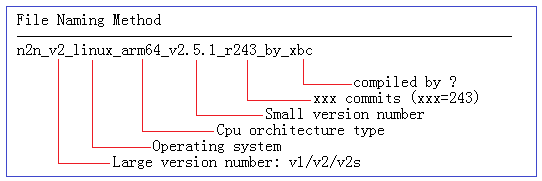

# docker n2n_lucktu:downloader

## 关于

> 此容器负责解析 _lucktu/n2n_ **源仓库文件**  
> 通过输入合适的参数，下载对应的文件至 `/tmp/down`

- 因 GITHUB API 限制 60 次/小时，不太合适用此方法

- 克隆 _lucktu/n2n_ **源仓库文件**
- 通过输入合适的参数，复制对应的文件至 `/tmp/down`
- 递归`/tmp/down`下压缩包及其内所有压缩文件
- 解压至其压缩文件无后缀所命名的文件夹中
- 选择最大 `edge` 所在目录，复制至 `/tmp/desc` `file`

## 参数说明

|    参数名     |       示例       |      定义      | 说明                                          |
| :-----------: | :--------------: | :------------: | :-------------------------------------------- |
|    KERNEL     |      linux       |      系统      | `uname -s`                                    |
|    MACHINE    | "arm64" | 处理器体系结构 | `uname -m` `x64` `x86` `arm64` `aarch64` `arm` |
|  BIG_VERSION  |        v3        |     大版本     | **v1** / **v2** / **v2s** / **v3**            |
| SMALL_VERSION |     3.1.1-16     |     小版本     | `(?<=v)\d\.\d\.\d`                            |
|    COMMIT     |       1200       |     提交号     | `(?<=_r).+?(?=[._])`                          |

